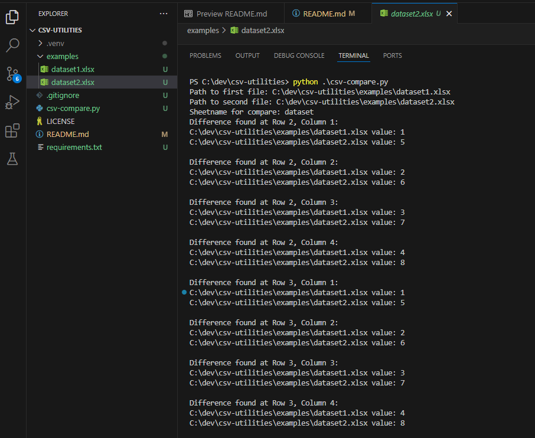

# csv-utilities

Utility project for csv files. The instruction provided below are for Windows machines but this can be used on any system.

## Prerequisites

#### Install Git

Use this link to install git for windows: https://git-scm.com/download/win

#### Install Python

Use this link to install python on windows: https://www.python.org/downloads/

## How to use

1.  From command line, type `git clone https://github.com/mtthwcnnrs/csv-utilities.git` wherever you want to save the project on your machine.
1.  Navigate to project root on the command line.
1.  Create a virtual environment using this command `python -m venv .venv`
1.  Run `python -c "import sys; print(sys.executable)"` and make sure the path ends with `\.venv\Scripts\python.exe`
1.  Run `pip install -r requirements.txt`
1.  Run `python .\csv-compare.py` and follow the prompts

        NOTE: The excel sheets need to have the same columns to work.

## Example

If you followed all of the instructions above, you can use the example files in `/examples` to do an example compare. The output show look like this:

